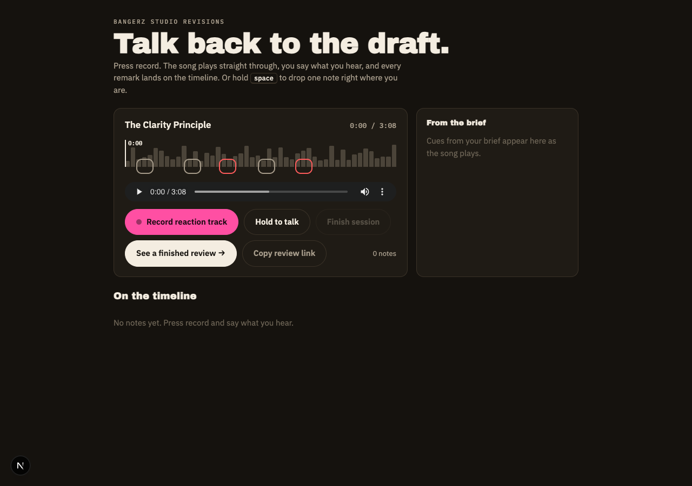
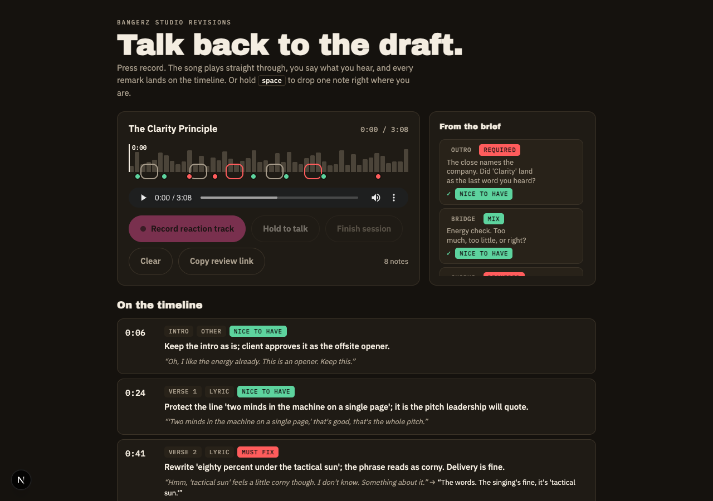
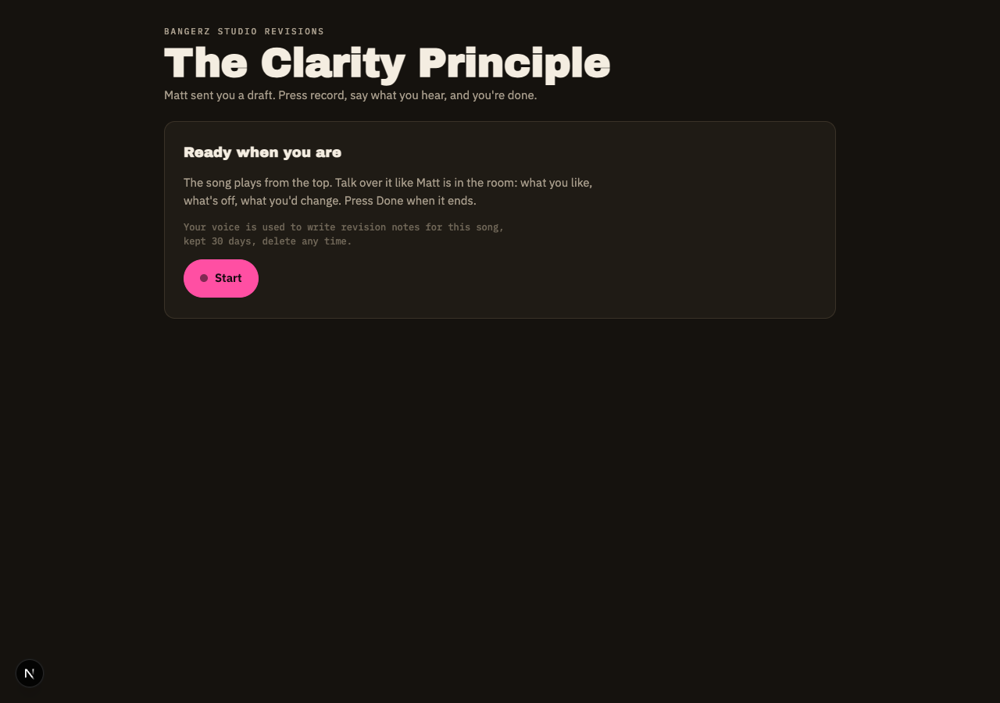
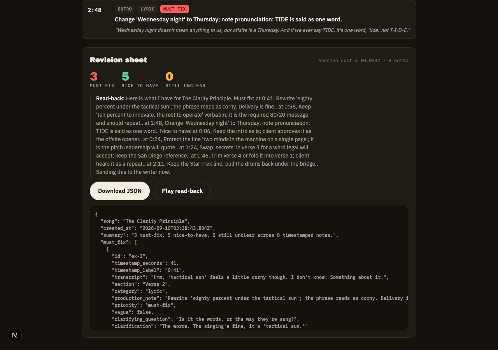

# Bangerz Studio Revisions

**Live:** https://slopathon.netlify.app · **Concept name:** Revision Room

The client talks back to the draft while it plays. The writer gets a timestamped, prioritized revision sheet instead of a paragraph of email.



## 1. What this is

**Revision Room** is the feedback step of a Business Bangerz project, rebuilt around the way clients actually react to music: out loud, in the moment, while it plays. The client presses record, the song runs start to finish, they say what they hear. Every remark lands on the song's timeline with a section, a category, a priority, and a one-line production note the writer can act on.

Three ways in, one sheet out:

- **Reaction track.** Press once. The song plays through, the client talks over it, nothing pauses. Whisper's segment timestamps pin every remark to the second.
- **Hold to talk.** Hold space, say one thing, release. The note is stamped where the client was in the song.
- **Review link.** The founder copies a link, pastes it in the delivery email, and the client does the whole listen alone. No call to schedule.

And a fourth thing that makes silence mean something: **Guided Listen.** Cues from the brief appear beside the player as the song reaches them ("The required message is 80/20. Did you hear the number?"). A remark inside the cue window answers it. No remark, and the sheet says so.

## 2. The outcome it targets

**Outcome: reduce cost.** **Friction: F2, revision friction.**

A banger costs about four cents to generate. The conversation around it is where the founder's hours go. Today a revision round is either a 30-minute call or an email like "chorus works, verse two feels corny, I liked the drums in the other version." No timestamp, no priority, no way to tell whether "the corny part" is the lyric or the delivery. The founder re-listens to find it, guesses at what matters, and writes the production notes himself.

Revision Room removes three costs from every round:

| Cost today | What replaces it |
| --- | --- |
| Translating prose into production notes | The sheet is the production notes |
| The "wait, which part?" follow-up email | Timestamps and one clarifying question, asked in the moment |
| The founder's calendar on the critical path | The client reviews alone via the link |

Our estimate is 1.5 to 2 founder hours back per song. At a solo shop doing a handful of songs a month, that is the difference between three songs and four in the same hours, without hiring anyone.

## 3. What actually works



Real, running in this repo:

- **Reaction track.** Continuous recording while the draft plays, transcript segments stamped to the song timeline, each segment structured into a note (MR-1, MR-2, OR-1, MR-3).
- **Hold-to-talk notes** stamped with the playback position where the client started talking (MR-1, MR-2).
- **Speech-to-text** with Whisper (OR-1).
- **Structuring** each remark into section, category, production note, and priority with a language model (MR-3).
- **One clarifying question,** spoken aloud, when a remark is too vague to act on. The next hold-to-talk answers it and the note updates in place (OR-3, OR-2).
- **Guided Listen.** Brief-derived cues pinned to seconds in the song, shown beside the player with a draining timer, notes tagged to the cue they answer, and the sheet listing confirmed and unanswered required checks.
- **Review link and client mode.** Copy review link, a landing card with a consent line, one Start button, one Done button, a "Sent to Matt" closing card with the captured notes read-only (OR-7).
- **Revision sheet.** Prioritized JSON, downloadable, with a spoken read-back of the must-fix list and a per-session cost estimate (MR-3, OR-2, OR-10).
- **Saved sessions and an event log** written to disk on finish: `link_created`, `session_started`, `session_finished` (OR-11).
- **Offline demonstration mode** with a recorded session and browser speech synthesis, no API key needed (OR-13).
- **Example session.** One click loads a full fictional client review so the finished state is visible without a microphone.
- Credentials from the environment, every variable in `.env.example` (OR-12).

Stubbed, mocked, or not built:

- **Demo mode notes are fixtures.** With `REVISION_ROOM_DEMO_MODE=1` or no `OPENAI_API_KEY`, the microphone records but the transcript and structured note come from `fixtures/session.json`, not from the audio.
- **The example session is written by hand.** The eight notes in `fixtures/example-session.json` are a fictional client, Dana Okafor of Tidewater Biologics, reacting to the real lyrics. They did not come from a live transcription.
- **Cues are hand-written JSON** in `fixtures/cues.json`. Generating them from the brief with a model is one call away and not built.
- **Sessions save to local disk,** not Supabase. On the hosted build the save is skipped. `supabase/migrations/0001_revision_sessions.sql` documents the intended table.
- **The review link has no token.** Anyone with the URL can review. No expiry, no email sending, no founder notification.
- **The reaction track hears the song too.** Browser echo cancellation handles most of it; headphones make it clean. Whisper's timestamps are accurate to about a second.
- **Section detection is a guess** from the words and the timestamp unless a cue matches.
- **No hummed-reference clips** and **no writer-side view.** The writer gets the JSON.

## 4. How it works



1. The founder opens the draft in Revision Room and clicks **Copy review link**, or sits with the client and runs it live.
2. The client presses **Start** (client mode) or **Record reaction track**. The song plays from the top. Cues from the brief appear beside the player as the song reaches them.
3. The client talks over the song. When they stop or the song ends, the recording is transcribed with segment timestamps.
4. Each segment, its timestamp, and the matching cue question go to a language model, which returns a structured revision note: section, category, a one-sentence production note in the writer's language, and a priority (must-fix, nice-to-have, unclear).
5. If a remark cannot be acted on without one more fact, the agent asks one clarifying question out loud. The client answers by holding to talk, and the note updates.
6. On **Finish**, every note is sorted by priority and time into the revision sheet. Required cues with a remark inside their window are listed as confirmed; required cues with none are listed as unanswered. The agent reads the must-fix list back, the sheet is saved, and the JSON is ready for the writer's next generation pass.



The whole workflow lives in `src/lib/revision-room.ts`. The API routes and the page are thin wrappers around it.

## 5. Setup

- Node 22 or newer, npm 10.
- `npm install`
- Copy `.env.example` to `.env.local`. Live mode needs `OPENAI_API_KEY` (whisper-1, gpt-4o-mini, tts-1; a full session costs a few cents). Leave it empty for offline demo mode.
- The demo draft is bundled at `public/audio/clarity-principle.mp3`. Set `NEXT_PUBLIC_SONG_URL` to stream it from Supabase storage instead.

## 6. The primary path

```
npm run demo        # offline, fixtures, no key
npm run start:live  # live, needs OPENAI_API_KEY in .env.local
```

Open http://localhost:3000.

- Fastest look: click **See a finished review**. Eight notes, the cue panel, and the sheet appear.
- Live: click **Record reaction track**, talk over the song for twenty seconds, click stop. Say something vague to get the clarifying question. Click **Finish session**.
- Client mode: click **Copy review link**, open it in a new tab, press **Start**.

A pre-baked sheet is in `fixtures/revision-sheet.json`.

## 7. What you did not build, and why

Cut on purpose:

- **Intake (F1) and memory (F6).** Other teams will build the brief interviewer. Revisions touch every project and nobody owns them.
- **Persisting to Supabase.** The sheet is shaped to sit next to the existing song record as a `revision_sessions` row. The migration is written; the insert is not. About an hour.
- **Generating cues from the brief.** One model call over the brief and the lyrics. The panel and the tagging are ready for it.
- **Hummed references.** The client should be able to hum the drum feel they want and have the clip attached to the note. Capture exists; attachment does not.
- **Regenerating the prompt.** With a Suno-style prompt on the song record, the must-fix notes could produce a lyric diff and a new prompt. The second hour.
- **Realtime speech-to-speech.** An assembled pipeline kept every step stubbable and the timestamps under our control.
- **Real tokens, expiry, and email sending** for the review link.

## 8. AI-use disclosure

- Claude (Claude Code, Fable 5.1) wrote most of the code, the fixtures, and this README from a plan agreed in conversation, ran two research passes on the public site to ground the business case, and built the Guided Listen and review-link features as parallel agents on separate branches.
- OpenAI whisper-1, gpt-4o-mini, and tts-1 run inside the product for transcription, structuring, and the spoken read-back. OpenAI's terms permit commercial use of API outputs.

## 9. Attribution

- Next.js, React, and the `openai` SDK, all MIT or Apache licensed. Fonts: Archivo Black, IBM Plex Sans, IBM Plex Mono via Google Fonts, SIL Open Font License.
- The demo draft is "The Clarity Principle," an original Business Bangerz portfolio song from its public Jukebox, bundled here with Business Bangerz as the audience of this prototype. It is not client material.
- The example client, Dana Okafor of Tidewater Biologics, is fictional.
- No voices were cloned. The read-back uses a stock synthetic voice. All recorded speech is the presenter's own.
